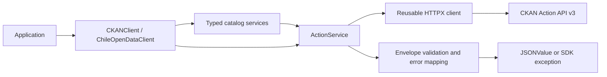
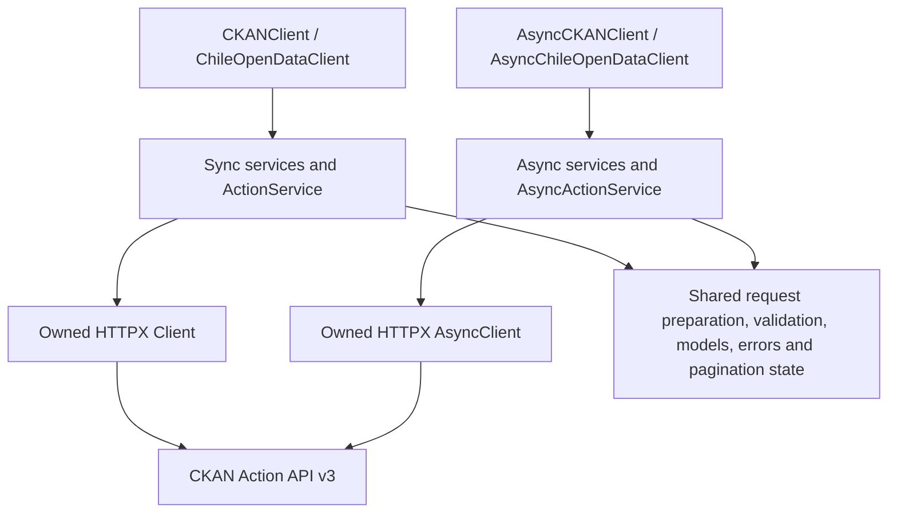

# Architecture

The foundation is small enough to keep network execution in `client.py`.
`CKANClient` owns one `httpx.Client` and exposes an `ActionService` at `actions`.
`catalog.py` composes dataset, resource, organization, group, and tag services
with the same `ActionService`, preserving one owned connection pool.
`ChileOpenDataClient` only supplies a default site. `ClientConfig` validates
immutable options independently of network I/O.

The public `responses` module handles error mapping and recursive diagnostic
redaction without executing requests. `models` contains the Pydantic v2 envelope,
`constants` centralizes defaults and immutable error maps, and `validation` exposes
runtime setting validators. These pure components will also serve the planned
asynchronous transport. Public JSON values use a recursive
type alias, while catalog models preserve CKAN extension fields.



There are only two direct runtime dependencies: HTTPX for HTTP and Pydantic for
response validation. Tenacity is deferred until the retry milestone. MockTransport
provides deterministic tests without another HTTP mocking dependency. Async test
utilities and dataframe extras will be introduced when their features exist.

The SDK does not configure global logging, read environment credentials, follow
redirects, retry requests, or create clients per call. TLS verification is enabled.
Synchronous code never starts an event loop.

Dependency management and builds use uv and uv_build. `uv.lock` records the full
development resolution; wheel metadata uses runtime ranges. The package includes
`py.typed`. The distribution is `chile-open-data-sdk` and the import is `chile_open_data_sdk`.


## Planned sync/async architecture (v0.3.0)

The synchronous implementation above is available in v0.2.0. The following design
is the target for v0.3.0, with acceptance criteria in the [roadmap](roadmap.md).



Keep existing public `client` and `catalog` imports. Add public `async_client` and
`async_catalog` modules, with root reexports for the async client and service
classes. Extract public `requests` or `pagination` helpers only where real shared
logic needs a home; do not create an `_internal` package or duplicate model trees.

HTTPX supplies separate sync and async transports and connection lifetimes; see
[HTTPX async support](https://www.python-httpx.org/async/). The SDK will follow that
split while sharing its domain logic. Async services will await native async I/O.
Synchronous services will continue to use synchronous I/O, with no hidden event
loop, thread-pool wrapper, or coroutine-to-sync bridge.

Each SDK instance owns its pool and injected transport. Closing it closes that
transport. An async instance is reused within its application's async lifetime;
cross-event-loop reuse is outside the planned contract. Concurrent calls may share
that instance, but each call keeps its payload and diagnostic context local.
Callers own task creation, concurrency limits, and cancellation; the SDK creates
no background workers. Tasks must finish or be cancelled before closing the client.

### Planned paired usage

Synchronous usage is available today:

```python
from chile_open_data_sdk import ChileOpenDataClient

with ChileOpenDataClient() as client:
    page = client.datasets.search("transport", rows=5)
    for dataset in page.results:
        print(dataset.title)
```

The equivalent async API is a design example, unavailable in v0.2.0:

```python
from chile_open_data_sdk import AsyncChileOpenDataClient


async def discover() -> None:
    async with AsyncChileOpenDataClient() as client:
        page = await client.datasets.search("transport", rows=5)
        for dataset in page.results:
            print(dataset.title)
        async for dataset in client.datasets.iter_search("transport", max_items=20):
            print(dataset.id)
```

The application invokes `discover` using its existing async runtime. The SDK does
not start that runtime. Configuration and Pydantic models are shared unchanged;
only network operations and lifecycle/iteration syntax differ.
