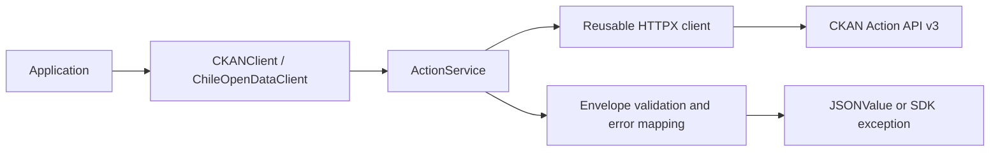

# Architecture

The foundation is small enough to keep network execution in `client.py`.
`CKANClient` owns one `httpx.Client` and exposes an `ActionService` at `actions`.
`ChileOpenDataClient` only supplies a default site. `ClientConfig` validates
immutable options independently of network I/O.

The `_internal.responses` module handles Pydantic v2 envelope validation, error
mapping, and recursive diagnostic redaction without executing requests. It can be
reused by the future asynchronous transport. Public JSON values use a recursive
type alias, while future entity models will preserve CKAN extension fields.

There are only two direct runtime dependencies: HTTPX for HTTP and Pydantic for
response validation. Tenacity is deferred until the retry milestone. MockTransport
provides deterministic tests without another HTTP mocking dependency. Async test
utilities and dataframe extras will be introduced when their features exist.

The SDK does not configure global logging, read environment credentials, follow
redirects, retry requests, or create clients per call. TLS verification is enabled.
Synchronous code never starts an event loop.

Dependency management and builds use uv and uv_build. `uv.lock` records the full
development resolution; wheel metadata uses runtime ranges. The package includes
`py.typed`. The distribution is `chile-open-data-sdk` and the import is `chile_open_data_sdk`.
